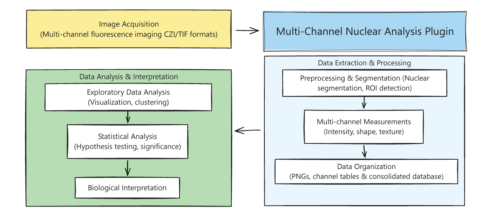

# Multi-Channel Nuclear Analysis

An ImageJ/FIJI plugin for analyzing multi-channel fluorescence images with a focus on nuclear segmentation using StarDist.

## Table of Contents

1. [Introduction](#introduction)
2. [Installation](#installation)
3. [Requirements](#requirements)
4. [Usage](#usage)
5. [Example Data Analysis with Python](#example)
6. [Plugin for Merging Channels into Multi-Channel TIF Files](#merge)
7. [Credits](#credits)
8. [Citation](#cite)

<a name="introduction"/>
## Introduction

Quantitative analysis of fluorescence microscopy images requires multiple steps, from image acquisition, followed by data extraction, visualization and statistical analysis. 



This tool allows researchers to easily extract fluorescence and shape based metrics from multi-channel fluorescence microscopy images by combining the power of the StarDist nuclear segmentation algorithm with customizable channel processing parameters. The macro automates routine tasks in image analysis workflows:

- Nuclear segmentation using StarDist
- Multi-channel intensity and shape measurements within segmented regions
- Data organization and export for further analysis
- Batch processing of multiple images

<a name="installation"/>
## Installation
Download the file "Multi_Channel_Nuclear_Analysis.ijm" by entering the file in the panel above and pressing the download button. Copy the file into FIJI/ImageJ plugins folder or, within FIJI/ImageJ, go to plugins > install and navigate to the file location. Restart FIJI before using the script. 

<a name="requirements"/>
## Requirements

- [ImageJ](https://imagej.nih.gov/ij/download.html) or [FIJI](https://fiji.sc/) (recommended)
- The following plugins installed in ImageJ/FIJI:
  - [StarDist](https://github.com/stardist/stardist)
  - [CSBDeep](https://github.com/CSBDeep/CSBDeep_website/wiki/CSBDeep-in-Fiji) (required for StarDist to function)


To install Stardist and CSBDeep plugins in FIJI:
1. Open FIJI
2. Go to `Help > Update...`
3. Click on `Manage update sites`
4. Check the boxes for:
   - **StarDist**
   - **CSBDeep**
5. Click `Close`
6. Click `Apply Changes`
7. Restart FIJI

This will ensure that both StarDist and its dependency CSBDeep are properly installed.

<a name="usage"/>
## Usage

1. Open ImageJ/FIJI
2. Run the macro by selecting `Plugins > Multi-Channel Analysis` (bottom of the list)
3. Follow the step-by-step dialog boxes to configure your analysis
4. Choose your input directory containing images 
5. Review results in the output directory

## Input Requirements

- **Image Format**: Images should be in TIF or CZI format (Zeiss microscope format). If your channels for an image are separated in different files, see "Plugin for merging channels into a single TIF file". 
- **Channel Organization**: All channels must be stored within the same image file
- **Image Structure**: The script expects fluorescence images with a nuclear channel for segmentation

## Preparation

Before running the script, it's recommended to:

1. **Explore Your Images**: Open a representative image in ImageJ/FIJI
2. **Determine Channel Count**: Check how many channels your images have (1-4 supported)
3. **Choose Background Subtraction Method**: For each channel, decide whether to use:
   - Standard background subtraction: Best for images with uniform background
   - Rolling ball background subtraction: Better for images with uneven background illumination
4. **Set Background Values**: 
   - For standard subtraction: Determine appropriate background values to subtract from each channel
   - For rolling ball method: Determine appropriate radius (in pixels) for each channel
5. **Determine Max Display Values**: Find suitable brightness values for optimal visualization
6. **Plan Channel Assignments**: Decide which channel will be used for nuclear segmentation

The values you determine in this preparation stage will be used in the configuration dialog boxes when running the script.

## Configuration Options

The script offers a user-friendly interface with three main configuration steps:

1. **Welcome Dialog**:
   - Select number of channels in your images (1-4)
   - Open the ImageJ "Set Measurements" dialog to select which measurements to include

2. **Channel Configuration**:
   - For each channel, set:
     - Background subtraction value
     - Background subtraction method:
       - Standard subtraction: Subtracts a fixed value from each pixel
       - Rolling ball method: Uses ImageJ's rolling ball algorithm to remove uneven background (value represents radius in pixels)
     - Maximum display value
     - Color for visualization
     - Suffix for naming output files

3. **Merge and Segmentation Configuration**:
   - Select which channels to include in merged visualization
   - Choose which channel to use for nuclear segmentation

## Output Files

The script generates the following outputs in an "analisis" subfolder:

### Images
- `[ImageName]_Channel#.png`: Individual channel images with applied settings
- `[ImageName]_segmentation.png`: Visualization of the segmentation results
- `[ImageName]_merge.png`: Merged multi-channel image (if configured)

### Data Files
- `[ImageName]_Channel#_tabla.csv`: Measurements for each individual channel
- `[ImageName]_allChannels.csv`: Combined measurements for all channels with shape features (Area, Perimeter, etc.) appearing once and intensity features (Mean, StdDev, etc.) for each channel
- `Complete_data.csv`: Concatenation of all _allChannels.csv files for batch analysis
- `[ImageName]RoiSet.zip`: ImageJ ROI file containing the segmented regions
- `analysis_parameters.txt`: Record of the analysis parameters used

## Data Analysis

The CSV tables are the primary output for further quantitative analysis:

### For Users Without Programming Skills
- Use the `[ImageName]_allChannels.csv` files for individual image analysis
- Use the `Complete_data.csv` file for analyzing all processed images
- Import these files into tools like GraphPad Prism, Excel, or similar software for plotting and statistical analysis

### For Users With Basic Programming Skills
- Use the `Complete_data.csv` file with Python (pandas, matplotlib, seaborn) or R to create:
  - More complex visualizations
  - Advanced statistical analyses
  - Custom data processing workflows
  - Correlations between channels or features

## Tips for Best Results

- Run the macro on a representative subset of images first to validate settings
- Ensure your nuclear segmentation works well using Stardist. If you get subnuclear segmentation, try changing the scale of the images (ctrl+E in FIJI)
- For images with uneven background illumination, use the rolling ball method rather than standard subtraction 
- Choose an appropriate rolling ball radius: typically 2-3× the size of the largest object that is not part of the background
- When using the rolling ball background subtraction method, the plugin measures and stores the mean fluorescence intensity of the background image in the CSV files (column name: "[ChannelSuffix]_Mean_rolling_background")
  - This measurement serves as a valuable internal control across your experimental conditions
  - In comparable samples, the mean background fluorescence should be relatively consistent
  - If one condition shows a significantly higher background value, it may indicate a methodological issue
  - High cell density can particularly affect rolling ball background calculation, as the algorithm may not be able to properly distinguish background from densely packed cells
  - Substantial differences in background measurements might suggest reconsidering the rolling ball radius or switching to a different background subtraction approach for that condition
- Adjust the StarDist parameters if needed for optimal segmentation
- Consider pre-processing images if they have high background or noise


<a name="example"/>
## Example Data Analysis with Python

To help users get started with data analysis, we provide an example dataset with analysis code in Python. This demonstrates a typical workflow from raw data to visualization.

### Example Experiment

This example is based on a real experiment involving mouse embryonic stem cells (mESCs) engineered to inducibly express a fusion protein comprising the transcription factor OCT6 linked to the mCherry fluorescent protein. Expression was induced by doxycycline treatment for 1, 2 or 3 days. An immunofluorescence was then performed against NANOG (alexa fluor 488), and nuclei were stained with DAPI. Channel 

Key experimental details:
- Cells: Mouse embryonic stem cells (mESCs)
- Channel 1: DAPI
- Channel 2: NANOG-488
- Channel 3: OCT6-mCherry
- Background subtraction methods:
  - mCherry channel: Rolling ball method (to address non-homogeneous background)
  - NANOG channel: Fixed background value subtraction

### Analysis Files

Download the example data and analysis files: <a href="https://github.com/Multichannel-nuclear-analysis/multichannel-nuclear-analysis.github.io/raw/main/example_data.zip" data-track="example-download">Download Example Dataset (ZIP)</a>

The ZIP file contains:
- Original microscopy images
- The analysis subfolder with the results of running the plugin


### Interactive Analysis in Google Colab

Explore the analysis interactively using our Google Colab notebook   <a href="https://colab.research.google.com/drive/15ovG3oCTq_nsUUFpJENDh1qMzkvqgYWr?usp=sharing" target="_blank" data-track="google-colab">
  
</a>

The notebook demonstrates:
1. Loading and exploring the CSV data from the ImageJ plugin
2. Data cleaning and transformation
3. Basic exploratory data analysis
4. Creating publication-quality visualizations


This example shows how different background subtraction methods (fixed value vs. rolling ball) can be applied to different channels based on their characteristics, and how to analyze the resulting data.


<a name="merge"/>
## Plugin for Merging Channels into Multi-Channel TIF Files

Some microscopes (such as Evos microscopes from ThermoFisher Scientific) save each channel as a separate TIF file instead of combining them into a multi-channel file. For these cases, we provide a companion plugin called `Merge_multi_channel_tif.ijm` that merges separate channel files into a single multi-channel TIF file before analysis.

### Installation and Usage

1. Download the `Merge_multi_channel_tif.ijm` file
2. Install it in the same way as the main plugin (copy to the FIJI/ImageJ plugins folder or use Plugins > Install)
3. Run the plugin through the Plugins menu
4. Follow the configuration dialogs to set up the channel merging

### File Naming Requirements

For the channel merging plugin to work correctly, your files must follow a consistent naming convention:

- Each set of files must share a common **base name**
- Each file must have a unique **channel suffix** at the end of the filename
- Files should use the `.tif` extension

**Example:**
```
10X-Image1-DAPI.tif   // Base name: "10X-Image1", Suffix: "-DAPI"
10X-Image1-488.tif    // Base name: "10X-Image1", Suffix: "-488"
10X-Image1-594.tif    // Base name: "10X-Image1", Suffix: "-594"
```

The plugin will identify files with the same base name, merge them according to the channel configuration you specify, and save the result as a multi-channel TIF file that can be used with the main analysis tool.


<a name="credits"/>
## Credits

Developed by Ariel Waisman at FLENI, Argentina

This tool utilizes the [StarDist](https://github.com/stardist/stardist) algorithm for nuclear segmentation:
> Uwe Schmidt, Martin Weigert, Coleman Broaddus, and Gene Myers.  
> Cell Detection with Star-convex Polygons.  
> International Conference on Medical Image Computing and Computer-Assisted Intervention (MICCAI), Granada, Spain, September 2018.

<a name="citation"/>
## Citation
Pending publication